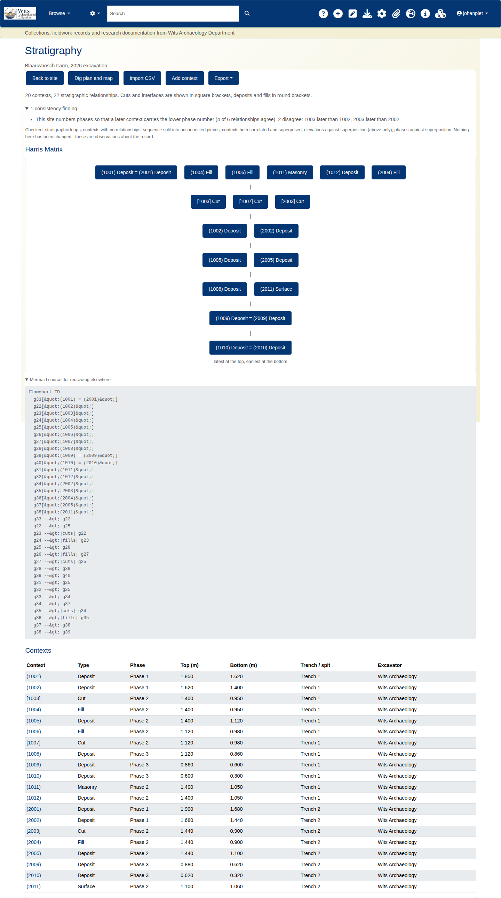
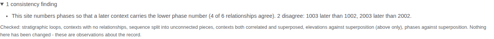
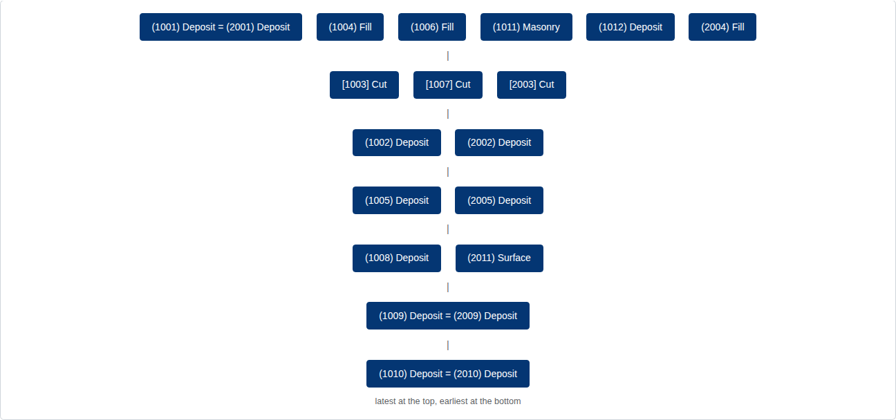
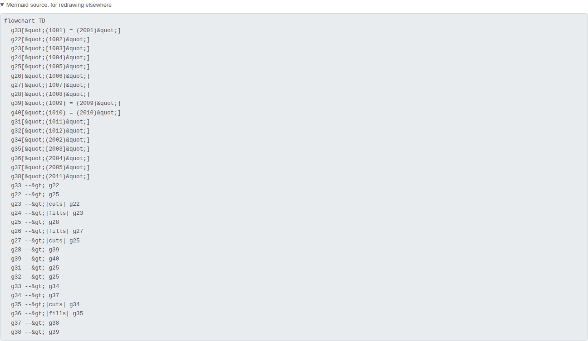
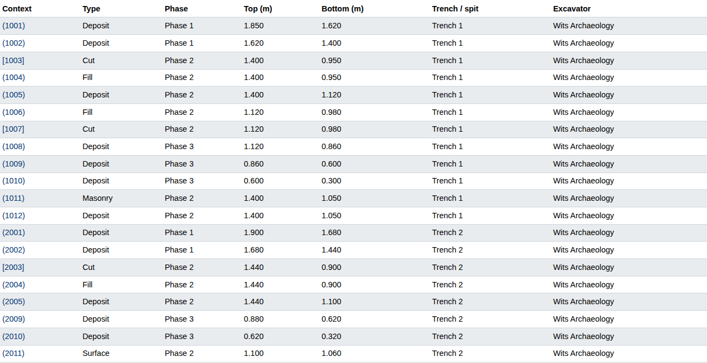
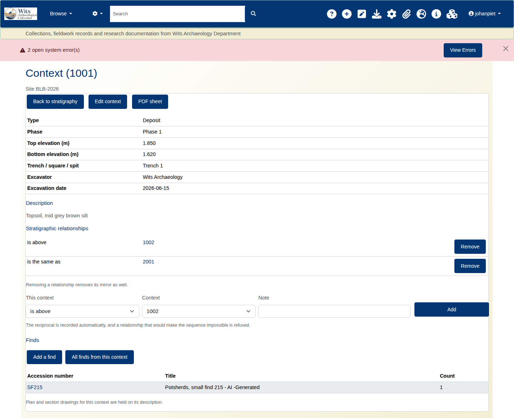
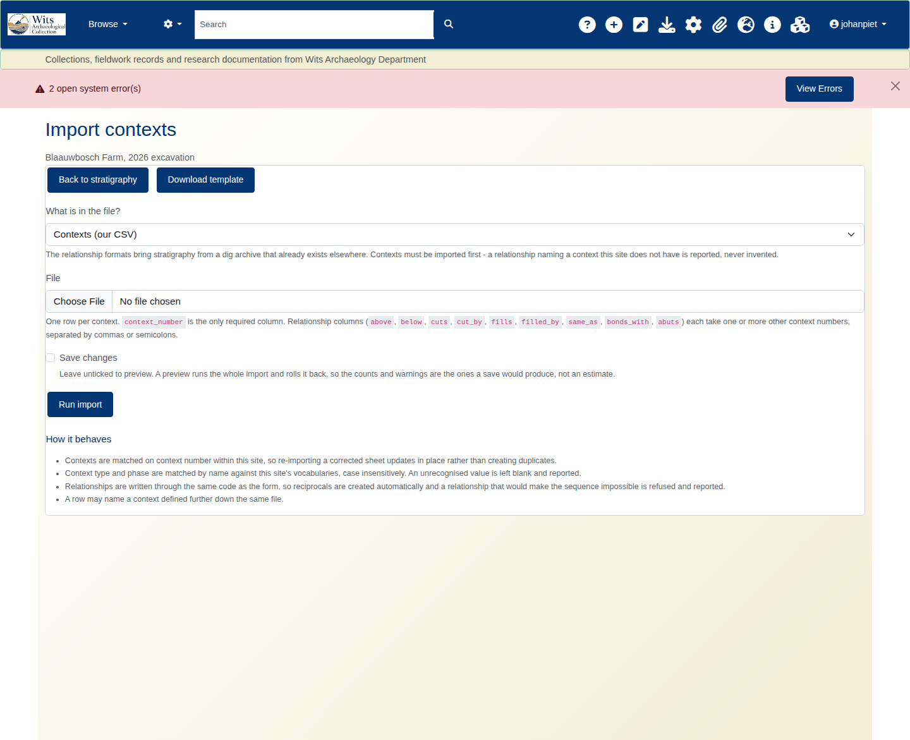
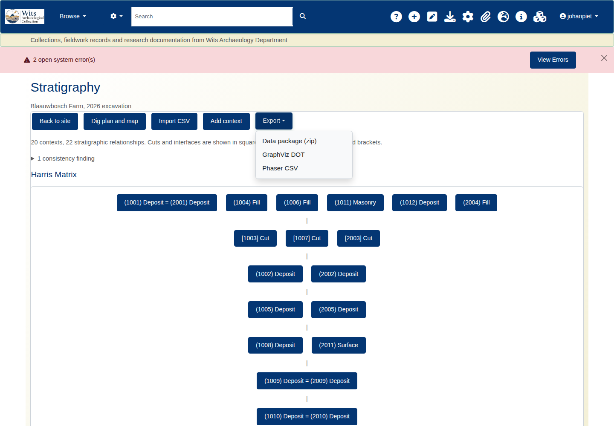

## What this covers

Recording stratigraphic relationships between contexts, reading the Harris Matrix the
system draws from them, understanding the consistency checks that run alongside it, and
getting the sequence in and out as CSV or as a graph file.

It assumes you already have a site and some contexts recorded. It does not teach
excavation.

## 1. The idea, briefly

A Harris Matrix is a diagram of *sequence*, not of space. It says which context is
earlier and which is later, and nothing about where anything sat on the ground. For
that, use **Dig plan and map** instead - a different view answering a different question.

Two points from Harris's method matter here, because the software enforces both.

**Only immediate relationships are drawn.** This is the Law of Stratigraphic Succession.
If you record that A is above B, B is above C, *and* A is above C, the third statement is
true but redundant - it is implied by the first two. Drawing it is wrong by the method,
because a matrix shows the shortest path between contexts.

The system removes those redundant lines from the drawing automatically. This is
**transitive reduction**.

**Your record is never altered.** The reduction applies to the diagram only. Every
relationship you recorded stays in the database, stays in the contexts table, and comes
back out in the exports. When lines are suppressed the page says so, so you can always
tell a correct reduction from data that has gone missing.

> If the summary line reports suppressed relationships, that is the system working. If it
> reports none and lines you recorded are missing from the drawing, that is a fault -
> report it.

## 2. Finding the matrix

**Archaeology > Sites**, open a site, then **Stratigraphy**.

```
/archaeology/site/<site id>/contexts
```

You must be signed in. Anonymous visitors get the login form.



Five actions sit under the heading:

| | |
|---|---|
| **Back to site** | The site record |
| **Dig plan and map** | The spatial view - where contexts sat, not what came first |
| **Import CSV** | Bulk load of contexts and relationships |
| **Add context** | A single new context |
| **Export** | Three formats, covered in section 6 |

## 3. Reading the page

The page runs top to bottom in a deliberate order.

### 3.1 The summary line

> *20 contexts, 22 stratigraphic relationships. Cuts and interfaces are shown in square
> brackets, deposits and fills in round brackets.*

Read this first. Two things to note.

**The bracket convention is the standard archaeological one** and is used everywhere on
this page, including the diagram and the contexts table:

- `[1003]` - a cut or an interface
- `(1001)` - a deposit or a fill

**The count is of relationships, not of records.** Each relationship is stored in both
directions - record *above* and *below* is written too - so the database holds roughly
twice this number of rows. The page reports what you recorded, not the storage.

If any lines were removed from the drawing, a further sentence reports how many.

### 3.2 Consistency checks

Collapsed by default, headed with the count - *"1 consistency finding"*. Click to open.

These sit **above** the diagram on purpose. A contradiction in the record changes how you
should read the drawing, and finding that out afterwards is too late.



Six checks run:

| Check | What it looks for |
|---|---|
| Stratigraphic loops | A sequence that eats its own tail - A above B above C above A. While this exists the sequence cannot be ordered and no matrix is drawn. |
| Contexts with no relationships | A context recorded but never related to anything. Usually unfinished rather than wrong. |
| Sequence split into unconnected pieces | Two or more groups with no relationship between them. Common and often correct on a multi-trench site. |
| Contexts both correlated and superposed | X recorded as the same as Y, and also above or below it. One statement must be wrong. |
| Elevations against superposition | A context recorded above another, with elevations saying otherwise. Checked for *above* only. |
| Phases against superposition | A relationship running against the site's own phase numbering. |

The panel closes with a line worth taking literally: **"Nothing here has been changed -
these are observations about the record."** A finding is a prompt to look, never an edit.

**Two checks are deliberately conservative, and the reasons matter.**

**Phase numbering direction is a site convention, not a rule.** Some sites number Phase 1
as earliest, others the reverse. The system does not assume either - it infers the
convention from the majority of that site's own relationships and reports only the
outliers, staying silent when there is no clear majority. The example above reads:

> *This site numbers phases so that a later context carries the lower phase number (4 of 6
> relationships agree). 2 disagree: 1003 later than 1002, 2003 later than 2002.*

Note "4 of 6". On a site with few phase-bearing relationships the inferred majority is
thin, and the outliers it names may be perfectly correct while the majority is the
accident. Treat the finding as a question about the site's convention, not a verdict on
those two relationships.

**Cuts do not follow deposit elevation logic.** A cut whose top sits exactly at the bottom
of the deposit it cuts is *correct* - a cut extends downward from the surface it was cut
from, and its fill sits inside it. The elevation check knows this and does not flag it.

### 3.3 The matrix



**Latest at the top, earliest at the bottom**, as labelled beneath the drawing.

**Correlated contexts share a node.** Where two contexts are recorded as the same, they
are drawn as one box joined by `=`: `(1001) Deposit = (2001) Deposit`. That is the point
of a correlation - the same event recorded twice in different trenches is one event in the
sequence, and drawing it twice would imply otherwise.

Two things can appear instead of a diagram: a **loop warning**, when the sequence contains
a cycle and cannot be ordered; and an **empty state**, when no relationships exist yet.

### 3.4 The diagram source

Collapsed, under *"Mermaid source, for redrawing elsewhere"*.



Copy it into any Mermaid renderer, Markdown document or wiki that supports it. Relationship
types carry through as edge labels, so `cuts` and `fills` stay legible in the redraw:

```
g23 -->|cuts| g22
g24 -->|fills| g23
```

This is the same reduction as the drawing above.

### 3.5 The contexts table



Every context on the site: number, type, phase, top and bottom elevation, trench or spit,
and excavator. This shows **everything recorded**, including anything suppressed from the
diagram. Context numbers link through to the individual record.

## 4. Recording relationships

Open a context from the table.



Nine types are supported. Each has a reciprocal, and recording one direction writes the
other - you never record both.

| You record | Meaning | Reciprocal | Sequence |
|---|---|---|---|
| `above` | is above | `below` | later |
| `below` | is below | `above` | earlier |
| `cuts` | cuts | `cut by` | later |
| `cut by` | is cut by | `cuts` | earlier |
| `fills` | fills | `filled by` | later |
| `filled by` | is filled by | `fills` | earlier |
| `same as` | is the same as | `same as` | none |
| `bonds with` | bonds with | `bonds with` | none |
| `abuts` | abuts | `abuts` | none |

The last three carry no sequence. They record that two contexts are contemporary or
physically joined, and do not move either up or down the matrix - though `same as` merges
them into a single node, as described above.

## 5. Importing a sequence

**Import CSV**, from the Stratigraphy page.



Upload contexts and their relationships together. A preview is shown before anything is
written.

**The preview is a real run that is rolled back**, not a simulation. It reports the exact
counts and warnings the commit will produce, because a preview that can diverge from the
real thing is worse than no preview. What you see is what you will get.

Check it for rows skipped, duplicates already present, and warnings about context numbers
that do not match existing records. A blank template is available from the same screen.

## 6. Exporting

The **Export** menu offers three formats, and appears only once there is a sequence to
export.



| Format | Use it for |
|---|---|
| **Data package** | The full record - contexts, relationships, site detail. Archiving, or moving a site between systems. |
| **DOT (Graphviz)** | Redrawing in Graphviz or anything that reads DOT, for publication figures. |
| **Phaser CSV** | Opening the sequence in Phaser or another stratigraphic package. |

```
/archaeology/site/<site id>/export/datapackage
/archaeology/site/<site id>/export/dot
/archaeology/site/<site id>/export/phaser
```

Exports carry **everything recorded**, not the reduced drawing. For the reduction, use the
Mermaid source.

## 7. When something looks wrong

**The matrix is missing lines I recorded.**
Check the summary line for a suppressed count. Redundant lines are removed by design; the
contexts table and the exports still hold everything.

**No matrix is drawn at all.**
Either there are no relationships yet, or the sequence contains a loop. The page says
which. A loop must be resolved before any ordering is possible.

**A relationship is flagged that I know is right.**
The phase and elevation checks are conservative and can flag genuine field situations,
particularly around cuts and re-cut features, and the phase check depends on a majority
that may be thin. A finding is a prompt to look.

**Two contexts I correlated appear as one box.**
That is correct - see 3.3.

**The page is slow on a large site.**
Dense records are heavier than large ones. Thousands of contexts in long chains are fine;
the same count with many relationships each is the harder case. Current performance is
about 60ms at 3,000 contexts and 12,000 relationships.

## Appendix: addresses

| | |
|---|---|
| Stratigraphy | `/archaeology/site/<id>/contexts` |
| Dig plan and map | `/archaeology/site/<id>/plan` |
| CSV import | `/archaeology/site/<id>/import` |
| Blank template | `/archaeology/site/<id>/import/template` |
| Exports | `/archaeology/site/<id>/export/<datapackage\|dot\|phaser>` |
| Contexts as JSON | `/archaeology/site/<id>/contexts.json` |
