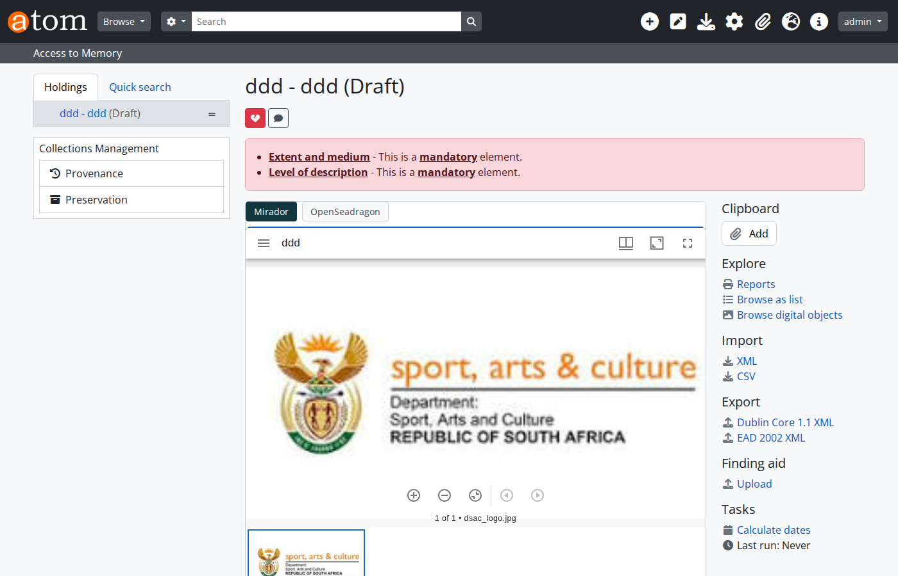
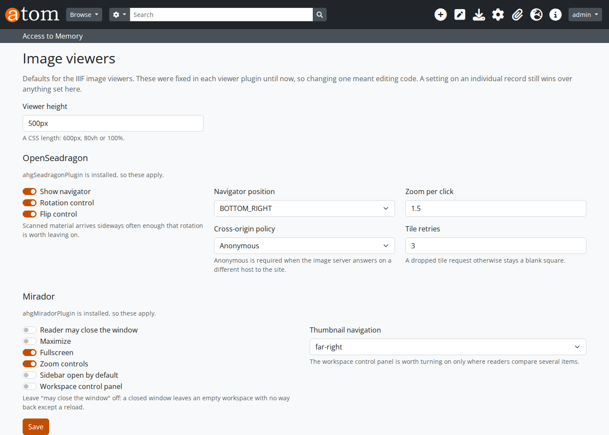
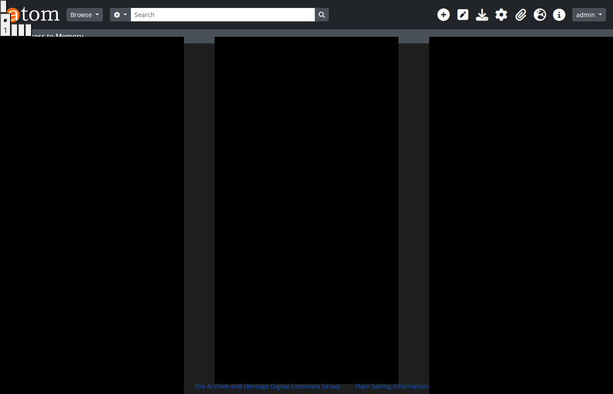
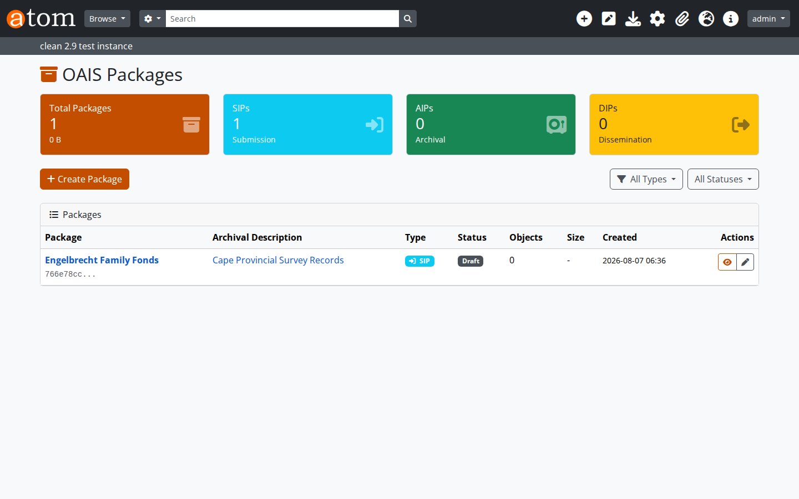
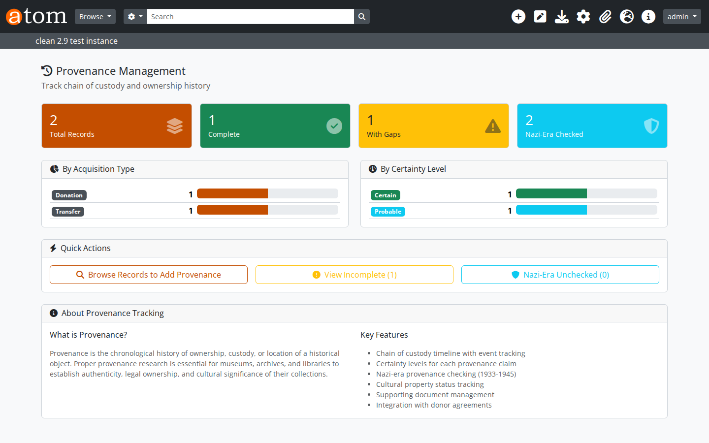
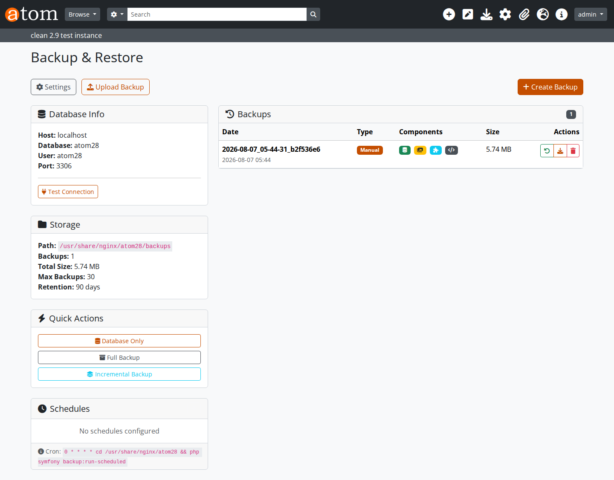
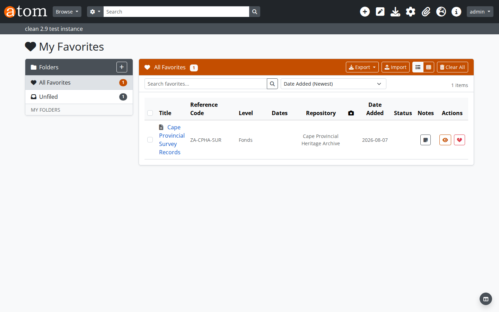
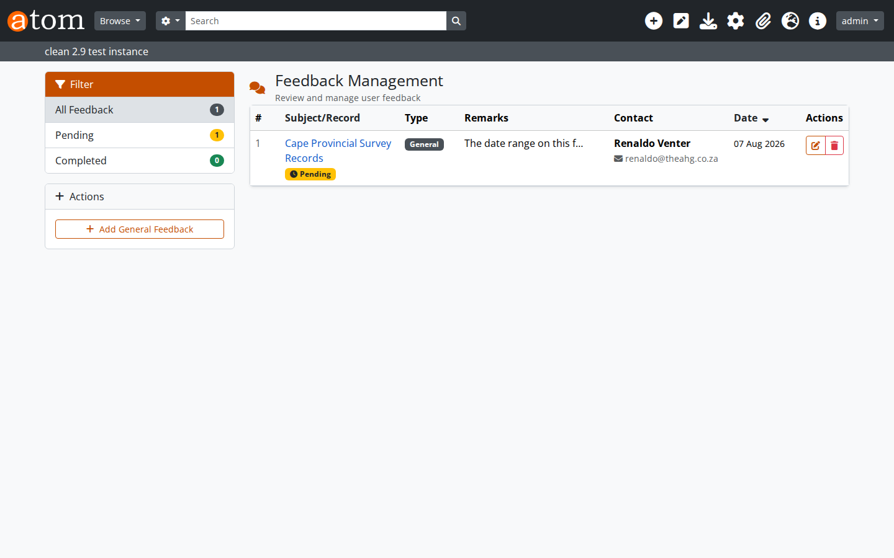

# AHG plugins for AtoM

Nine plugins for [Access to Memory](https://accesstomemory.org) 2.9 and 2.10. Each installs on its own, and nothing in base AtoM is modified - no file under `apps/`, `lib/`, `vendor/` or `config/` is touched, and `ProjectConfiguration.class.php` stays as upstream ships it.

This page lists the **current version of each**. For older versions see the [full release history](https://github.com/ArchiveHeritageGroup/atom-ahg-plugins/releases).

## Install the runtime first

| | Version | |
|---|---|---|
| **AHG Runtime** - the shared foundation every plugin depends on | 2.14.1 | [Download](https://github.com/ArchiveHeritageGroup/atom-ahg-plugins/releases/tag/ahgRuntimePlugin-v2.14.1) |

It ships once, separately, because it is the large part and identical for all of them. It also provides `bin/ahg`, the command-line entry point that makes plugin tasks available to cron.

Requirements are the same throughout: **AtoM 2.9 or 2.10, PHP 8.1+, MySQL 8.0**. AtoM 2.8 is not supported - it is the last release on PHP 7.4, and the runtime is built on Laravel 10, which is PHP 8.1+ by construction.

## The plugins

### IIIF - 1.2.0

Manifests, collections, annotations, search, authorisation, OCR export and media handling. Presentation API 3.0 with a 2.1 path, Image API 2 and 3 both advertised, Content Search 2.0, Auth 1.0 and 2.0, Change Discovery 1.0.

Manifests carry `structures` so multi-page material gets a table of contents, plus `rights`, `requiredStatement`, `provider`, `thumbnail`, `seeAlso`, `start`, `behavior`, `viewingDirection`, `navDate`, `partOf` and `rendering`.



[Download IIIF 1.2.0](https://github.com/ArchiveHeritageGroup/atom-ahg-plugins/releases/tag/ahgIiifPlugin-v1.2.0) · [Full documentation](../../ahgIiifPlugin/README.md)

### Seadragon viewer - 1.1.0

OpenSeadragon 4.1.0 deep zoom. Registers itself with the IIIF renderer registry, so a site can install this viewer, Mirador, both or neither.

Opens a IIIF manifest, navigates multi-page sequences, and offers rotation and flip - which scanned material needs more often than you would like. Falls back to a flat image where no image server is installed.



[Download Seadragon 1.1.0](https://github.com/ArchiveHeritageGroup/atom-ahg-plugins/releases/tag/ahgSeadragonPlugin-v1.1.0) · [Full documentation](../../ahgSeadragonPlugin/README.md)

### Mirador viewer - 1.1.0

Mirador 3, for side-by-side comparison across collections. Renders manifest ranges as a navigable table of contents, and follows the interface language rather than defaulting to English.



[Download Mirador 1.1.0](https://github.com/ArchiveHeritageGroup/atom-ahg-plugins/releases/tag/ahgMiradorPlugin-v1.1.0) · [Full documentation](../../ahgMiradorPlugin/README.md)

### Digital Preservation - 1.0.6

Checksums, fixity verification, PREMIS events, format identification and BagIt packaging. A package built from a record arrives holding that record's masters, and builds and exports to a downloadable bag in one action.

Ten `preservation:*` command-line tasks for scheduling - fixity, virus scan, format identification, migration planning, replication.



[Download Preservation 1.0.6](https://github.com/ArchiveHeritageGroup/atom-ahg-plugins/releases/tag/ahgPreservationPlugin-v1.0.6)

### Provenance Tracking - 1.2.3

Chain of custody for archival records, museum objects and library material, with a coverage view showing what is documented and what is not.



[Download Provenance 1.2.3](https://github.com/ArchiveHeritageGroup/atom-ahg-plugins/releases/tag/ahgProvenancePlugin-v1.2.3)

### Backup and Restore - 1.1.2

Database and file backup with scheduling, restore, upload and retention management.



[Download Backup 1.1.2](https://github.com/ArchiveHeritageGroup/atom-ahg-plugins/releases/tag/ahgBackupPlugin-v1.1.2)

### Favourites - 2.0.1

Per-user bookmarks with folders, notes, bulk operations and export.



[Download Favourites 2.0.1](https://github.com/ArchiveHeritageGroup/atom-ahg-plugins/releases/tag/ahgFavoritesPlugin-v2.0.1)

### Feedback - 1.0.6

Reader feedback and corrections against archival records, with a queue for staff.



[Download Feedback 1.0.6](https://github.com/ArchiveHeritageGroup/atom-ahg-plugins/releases/tag/ahgFeedbackPlugin-v1.0.6)

## Installing

Each bundle carries its own dependencies and an `INSTALL.md` with the enable order. In short, from the AtoM root:

```bash
unzip ahgRuntimePlugin-2.14.1.zip -d plugins/     # first, shared by all
unzip <plugin>.zip                -d plugins/
chown -R www-data:www-data plugins/
mysql -u <user> -p <database> < plugins/<plugin>/database/install.sql
```

Then enable in **Admin > Plugins**, clear the cache and reload PHP.

## Infrastructure, if you want it

Optional, and deliberately separate - your web server and image server are yours:

- [Setting up an IIIF image server](../infrastructure/iiif-image-server.md) - requirements, Cantaloupe, authorisation, and how to prove it refuses
- [nginx](../infrastructure/nginx.md) - proxying an image server, serving derivatives, the `ProtectSystem=full` trap, CSP

**One thing to carry across whichever image server you use.** It reads files straight off disk and knows nothing about AtoM's access control, so left open, every master under `uploads/r/` is retrievable through the IIIF endpoint by anyone who can form the path - and those paths appear in every manifest. The Cantaloupe delegate that closes this ships with the IIIF plugin.

## Older versions

Everything above is the current release. Previous versions, and the repository-wide `v1.6.x` and `v1.7.x` tags that predate per-plugin packaging, are on the [releases page](https://github.com/ArchiveHeritageGroup/atom-ahg-plugins/releases).

Licence: AGPL-3.0-or-later.
